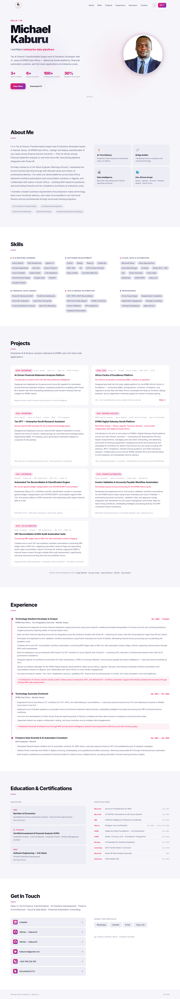

# Michael Kaburu — Personal Portfolio

A personal portfolio website showcasing my professional background, technical skills, and project work as a Tax & Finance AI expert and Full-Stack Engineer based in Nairobi, Kenya.

## Description

This is a responsive, single-page portfolio website built with HTML, CSS, and JavaScript. It highlights my experience at KPMG East Africa in AI-driven tax and finance transformation, as well as my software development projects.

## Live Link

[https://kaburu12.github.io/My-portfolio/](https://kaburu12.github.io/My-portfolio/)

## Technologies Used

- **HTML5** — page structure and semantic markup
- **CSS3** — responsive styling and UI design
- **JavaScript** — interactivity and dynamic content

## Project Setup

1. Install [Visual Studio Code](https://code.visualstudio.com/)
2. Clone the repository: `git clone https://github.com/Kaburu12/My-portfolio.git`
3. Install the **Live Server** VS Code extension
4. Open `index.html` and click **Go Live**

To deploy updates:
```bash
git add .
git commit -m "your message"
git push
```
The site is published via GitHub Pages and updates automatically on push.

## Portfolio Screenshot



## License

Copyright (c) 2026 Michael Kaburu

Permission is hereby granted, free of charge, to any person obtaining a copy of this software and associated documentation files (the "Software"), to deal in the Software without restriction, including without limitation the rights to use, copy, modify, merge, publish, distribute, sublicense, and/or sell copies of the Software, and to permit persons to whom the Software is furnished to do so, subject to the following conditions:

The above copyright notice and this permission notice shall be included in all copies or substantial portions of the Software.

THE SOFTWARE IS PROVIDED "AS IS", WITHOUT WARRANTY OF ANY KIND, EXPRESS OR IMPLIED, INCLUDING BUT NOT LIMITED TO THE WARRANTIES OF MERCHANTABILITY, FITNESS FOR A PARTICULAR PURPOSE AND NONINFRINGEMENT. IN NO EVENT SHALL THE AUTHORS OR COPYRIGHT HOLDERS BE LIABLE FOR ANY CLAIM, DAMAGES OR OTHER LIABILITY, WHETHER IN AN ACTION OF CONTRACT, TORT OR OTHERWISE, ARISING FROM, OUT OF OR IN CONNECTION WITH THE SOFTWARE OR THE USE OR OTHER DEALINGS IN THE SOFTWARE.

## Author

**Michael Kaburu Rapando**
Tax & Finance Transformation Expert | AI Solutions Developer | Full-Stack Engineer

- KPMG East Africa — Technology Solutions Developer & Analyst (Tax & Regulatory Services, Oct 2023–Present)
- Formally trained Full-Stack Engineer, Moringa School (2022)
- B.Econ, Moi University (2021) | CIFA Candidate (KASNEB, in progress)

## Contact & Support

- **Email:** kabururm@gmail.com
- **Phone:** +254 796 225 100
- **GitHub:** [Kaburu12](https://github.com/Kaburu12)
- **GitHub:** [Kaburu13](https://github.com/Kaburu13)
- **LinkedIn:** [michael-kaburu-a1718a125](https://www.linkedin.com/in/michael-kaburu-a1718a125)
